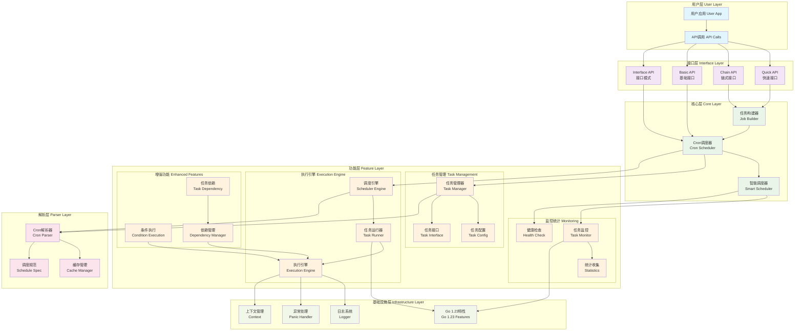

# Cron调度库架构图

## 架构说明

### 🏗️ 分层架构设计

#### 1. 用户层 (User Layer)
- **用户应用**: 最终用户的业务应用
- **API调用**: 通过各种API接口调用调度功能

#### 2. 接口层 (Interface Layer)
- **Quick API**: 快速创建简单任务的便捷接口
- **Chain API**: 链式调用接口，支持流畅的配置
- **Basic API**: 传统的基础接口，保持向后兼容
- **Interface API**: 支持接口模式的任务定义

#### 3. 核心层 (Core Layer)
- **Cron调度器**: 核心调度逻辑
- **任务构建器**: 支持链式调用的任务构建
- **智能调度器**: 具备自适应优化能力的高级调度器

#### 4. 功能层 (Feature Layer)
- **任务管理**: 任务的增删改查和配置管理
- **执行引擎**: 任务的实际执行和调度
- **增强功能**: 条件执行、任务依赖等高级特性
- **监控统计**: 实时监控和统计分析

#### 5. 解析层 (Parser Layer)
- **Cron解析器**: 解析各种cron表达式格式
- **缓存管理**: 解析结果缓存，提升性能
- **调度规范**: 标准化的调度规范定义

#### 6. 基础设施层 (Infrastructure Layer)
- **日志系统**: 统一的日志记录
- **异常处理**: 全局异常捕获和处理
- **上下文管理**: Context支持和管理
- **Go 1.23特性**: 充分利用Go 1.23新特性

### 🔄 数据流向

1. **用户请求** → 接口层 → 核心层
2. **任务配置** → 功能层 → 解析层
3. **任务执行** → 执行引擎 → 基础设施层
4. **监控数据** → 监控统计 → 用户反馈

### 🎯 设计优势

- **分层清晰**: 职责分离，易于维护
- **高内聚低耦合**: 模块间依赖关系清晰
- **可扩展性**: 新功能可以轻松集成
- **向后兼容**: 保持API稳定性
- **性能优化**: 缓存和Go 1.23特性优化