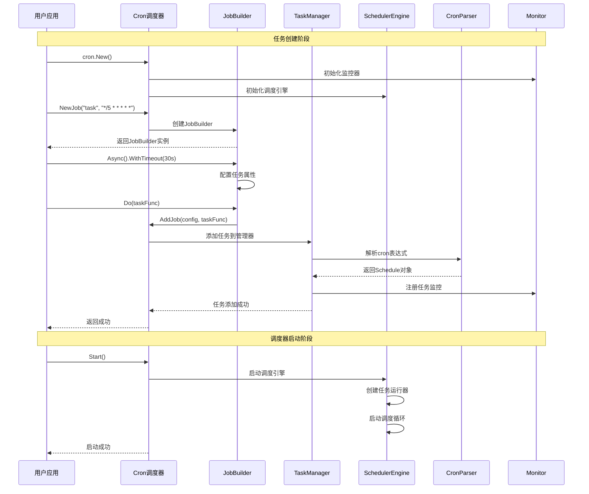
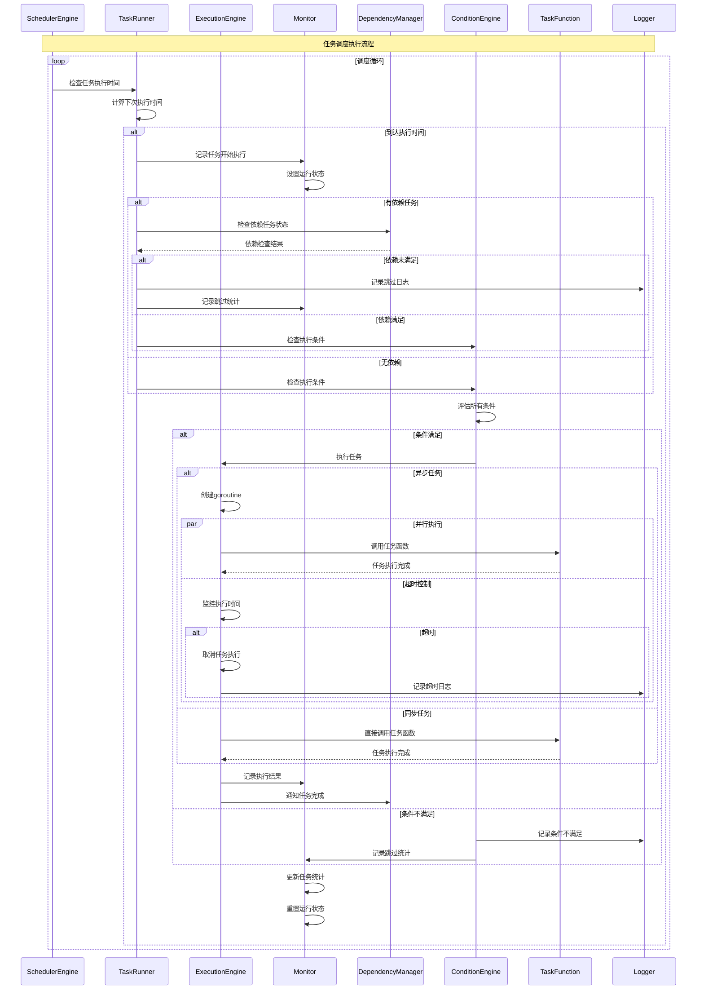
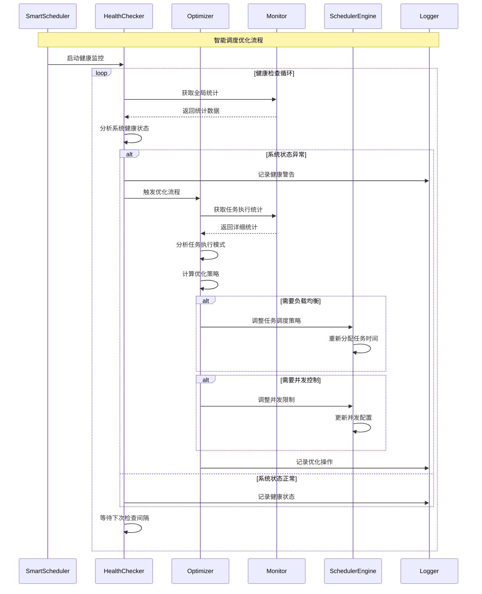
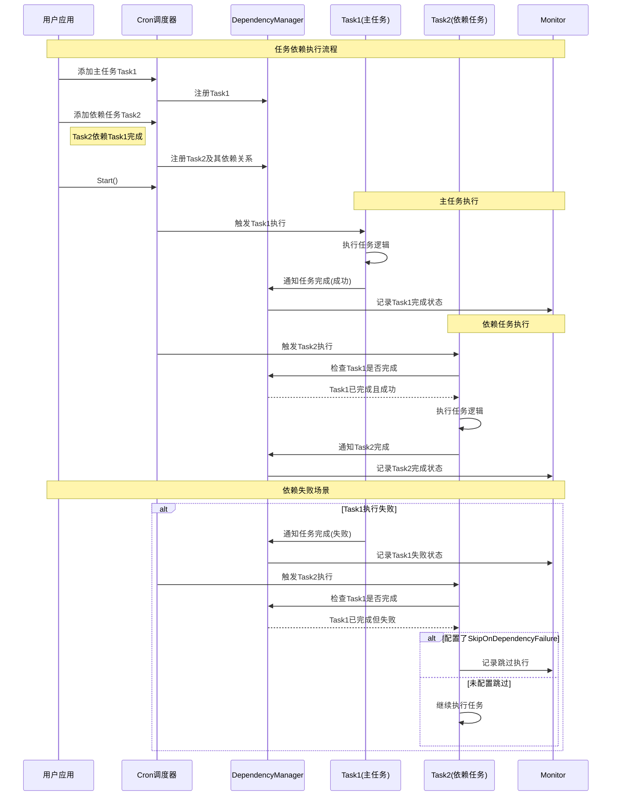

# Cron调度库时序图

## 1. 任务创建和启动时序图

## 2. 任务执行时序图

## 3. 智能调度器优化时序图

## 4. 任务依赖执行时序图

## 时序图说明

### 🔄 执行流程特点

1. **异步处理**: 支持异步任务执行，不阻塞调度器
2. **依赖管理**: 智能处理任务间的依赖关系
3. **条件检查**: 执行前进行条件验证
4. **监控统计**: 全程记录任务执行状态和统计信息
5. **智能优化**: 自动分析和优化调度策略

### ⚡ 性能优化点

- **并行执行**: 异步任务并行处理
- **缓存机制**: cron表达式解析结果缓存
- **智能调度**: 根据执行统计自动优化
- **资源控制**: 并发数限制和超时控制