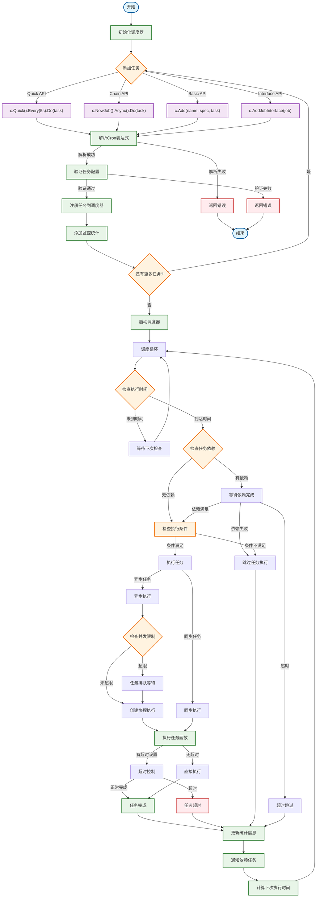
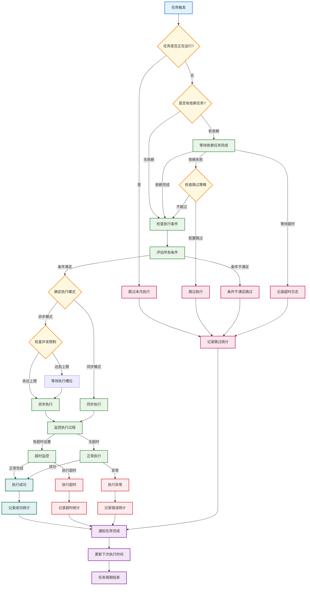
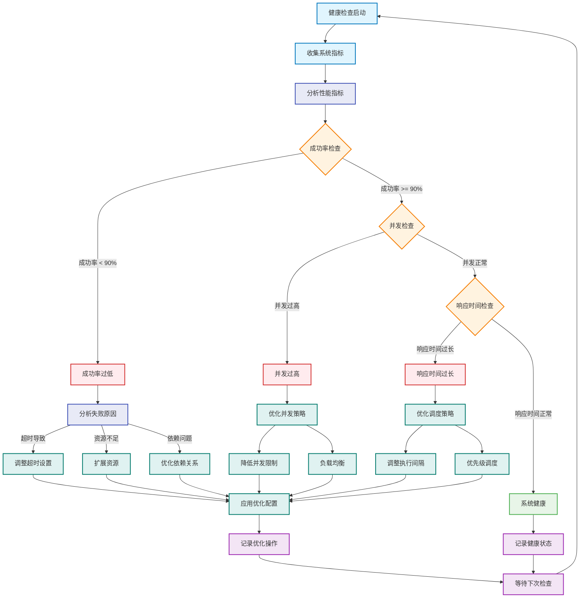

# Cron调度库工作流程图

## 1. 整体工作流程

## 2. 任务执行决策流程

## 3. 智能调度优化流程

## 工作流程说明

### 🔄 核心流程特点

1. **多API支持**: 提供4种不同的API接口满足不同使用场景
2. **智能决策**: 基于依赖、条件、并发等多维度决策
3. **自动优化**: 智能调度器自动分析和优化性能
4. **全程监控**: 从任务创建到执行完成的全程监控

### ⚡ 性能优化策略

- **并发控制**: 动态调整并发限制
- **负载均衡**: 智能分配任务执行时间
- **缓存机制**: cron表达式解析结果缓存
- **资源管理**: 自动检测和优化资源使用

### 🛡️ 容错机制

- **依赖处理**: 智能处理任务依赖失败
- **超时控制**: 防止任务无限期执行
- **异常捕获**: 全局panic捕获和处理
- **重试机制**: 可配置的任务重试策略