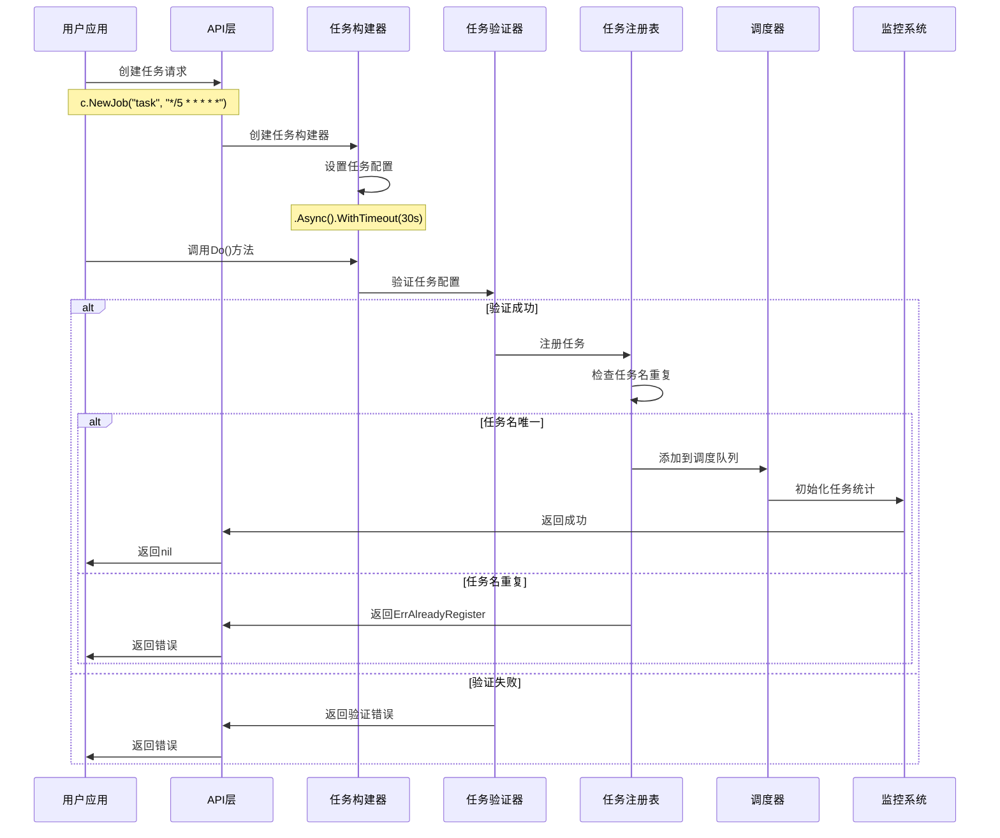
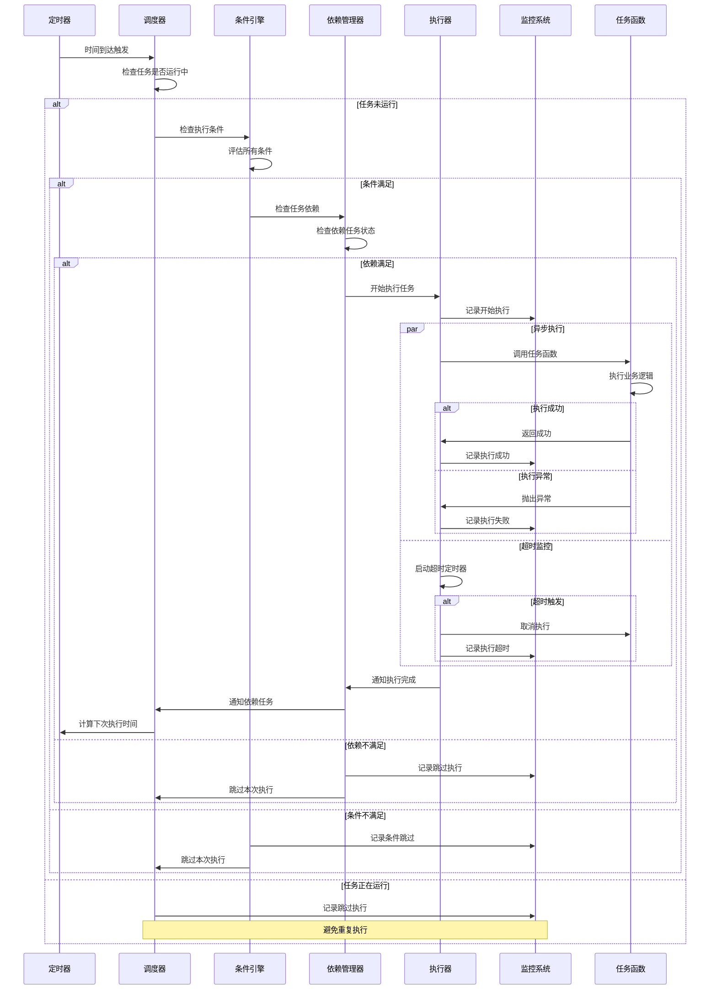
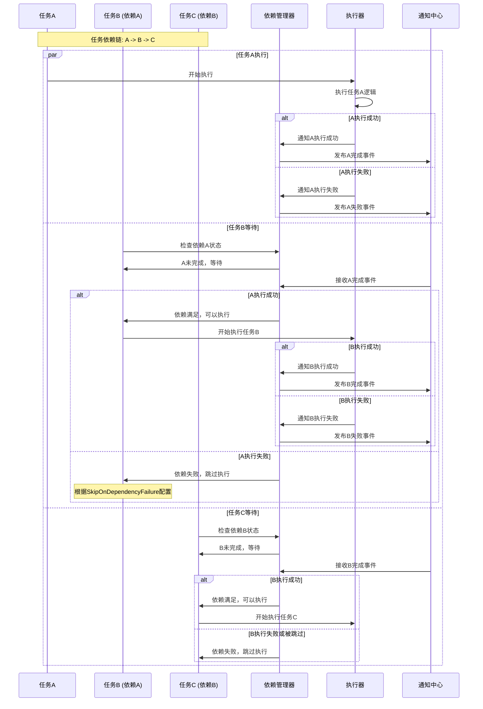
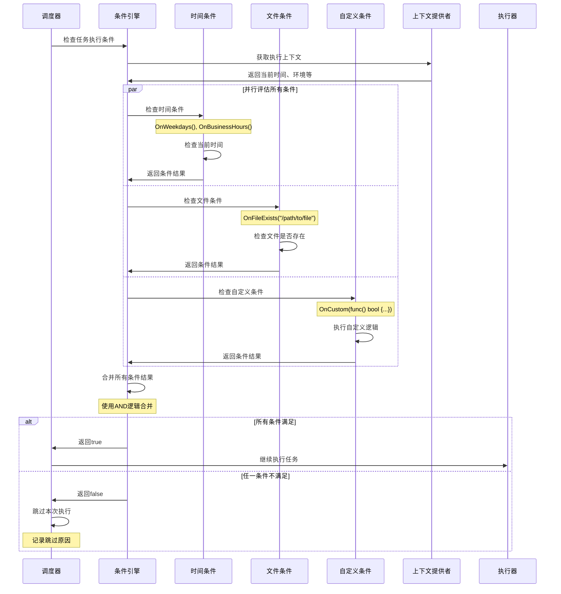
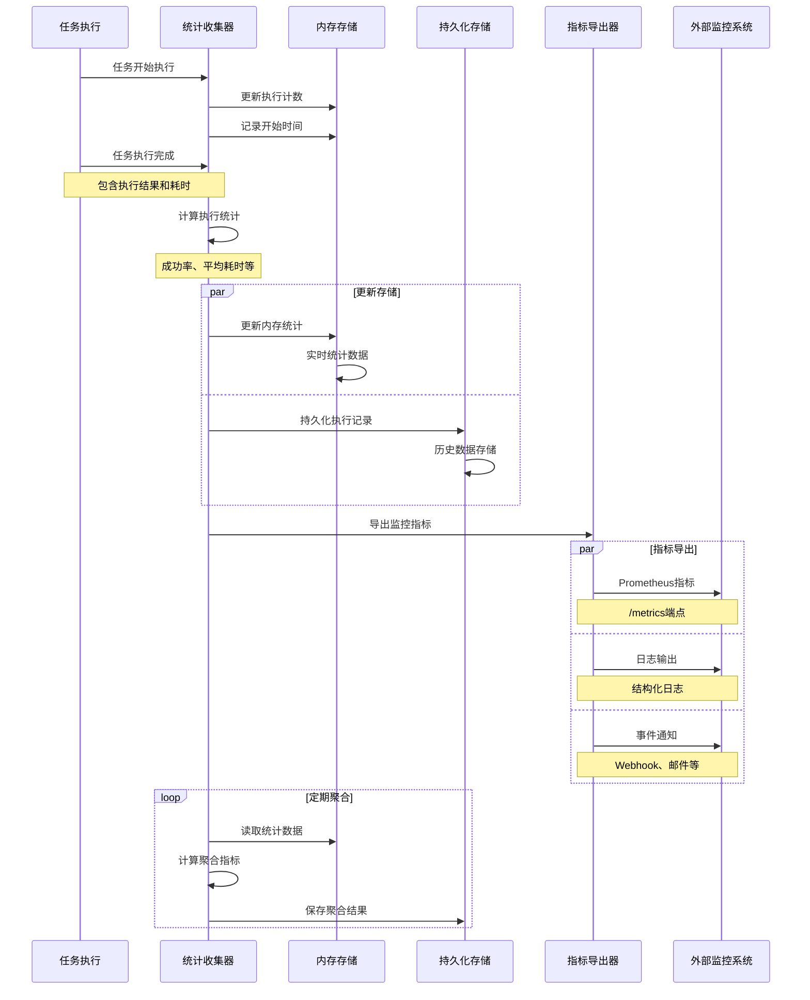
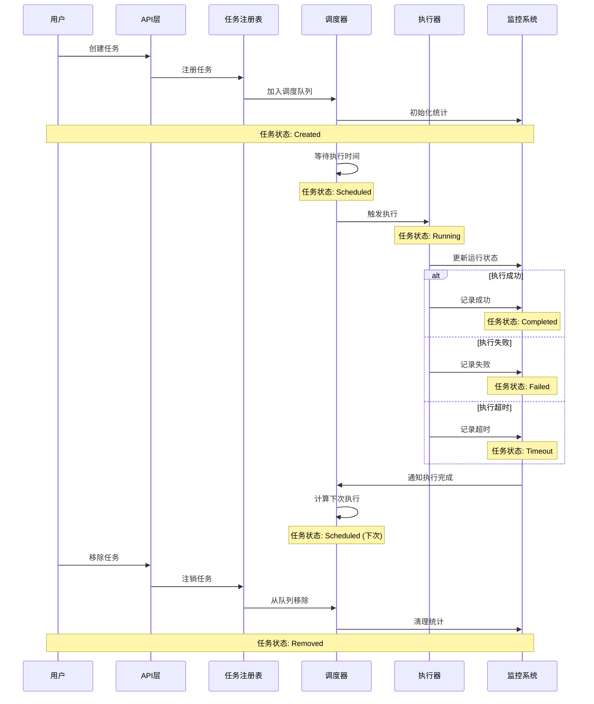

# 时序图

## 📊 时序图说明

本文档展示了Cron调度库中关键业务流程的时序图，帮助理解各组件间的交互时序和数据流向。

## 🚀 任务创建和注册时序图



## ⚡ 任务执行时序图



## 🔄 智能调度优化时序图

```mermaid
sequenceDiagram
    participant HealthMonitor as 健康监控
    participant StatsCollector as 统计收集器
    participant SmartScheduler as 智能调度器
    participant Optimizer as 优化器
    participant Scheduler as 调度器
    participant AlertManager as 告警管理
    
    loop 健康检查循环
        HealthMonitor->>StatsCollector: 收集系统指标
        StatsCollector->>StatsCollector: 计算成功率、响应时间等
        StatsCollector->>Health
        
        HealthMonitor->>HealthMonitor: 分析
        
        alt 系统健康
            HealthMonitor->>SmartScheduler: 报告健康状态
            Note over HealthMonitor,SmartScheduler: 状态: healthy
        else 发现性能问题
            HealthMonitor->>Optimizer: 触发优化流程
            
            alt 成功率过低
                Optimizer->>Optimizer: 分析失败原因
                Optimizer->>Scheduler: 调整超时设置
                Optimizer->>Scheduler: 优化重试策略
            else 并发过高
                Optimizer->>Scheduler: 降低并发限制
                Optimizer->>Scheduler: 启用负载均衡
            else 响应时间过长
                Optimizer->>Scheduler: 调整执行间隔
                Optimizer->>Scheduler: 启用优先级调度
            end
            
            Optimizer->>HealthMonitor: 应用优化配置
            HealthMonitor->>AlertManager: 发送优化通知
        else 系统异常
            HealthMonitor->>AlertManager: 发送告警
            AlertManager->>AlertManager: 处理告警逻辑
            Note over AlertManager: 邮件、Webhook等通知
        end
        
        HealthMonitor->>HealthMonitor: 等待下次检查
    end
```

## 📊 任务依赖执行时序图



## � 条件执档行评估时序图



## 📈 监控统计收集时序图



## 🔄 任务生命周期时序图



## 📝 时序图说明

### 关键时序特点

1. **异步执行**: 任务执行采用异步模式，避免阻塞调度器
2. **并行处理**: 条件检查、依赖验证等支持并行处理
3. **事件驱动**: 基于事件通知机制实现组件间解耦
4. **超时控制**: 所有长时间操作都有超时保护机制

### 性能优化点

1. **批量操作**: 统计收集和存储更新采用批量模式
2. **缓存机制**: 频繁访问的数据使用缓存加速
3. **异步通知**: 事件通知采用异步方式避免阻塞
4. **资源池**: 使用对象池减少内存分配开销

### 错误处理策略

1. **优雅降级**: 组件故障时自动降级保证核心功能
2. **重试机制**: 临时故障自动重试恢复
3. **故障隔离**: 单个任务故障不影响其他任务
4. **监控告警**: 异常情况及时监控和告警

## 🔄 更新记录

- 2025-07-23: 创建时序图文档
- 2025-07-23: 添加任务创建、执行、依赖等核心时序图
- 2025-07-23: 完善智能调度和监控相关时序图