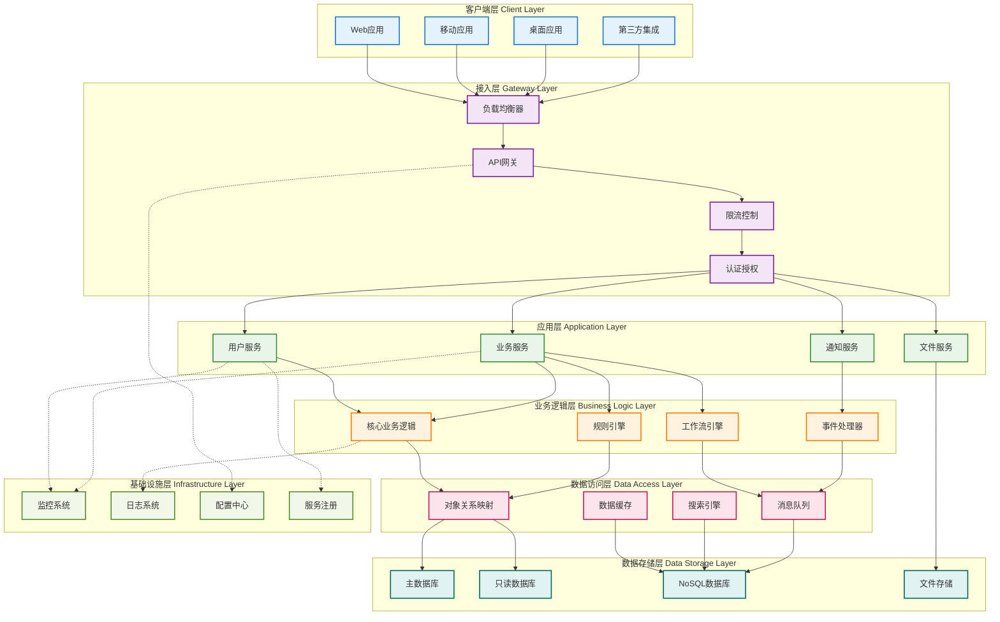
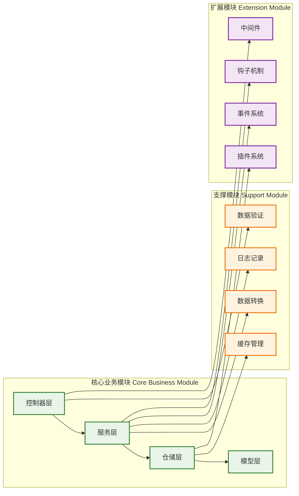
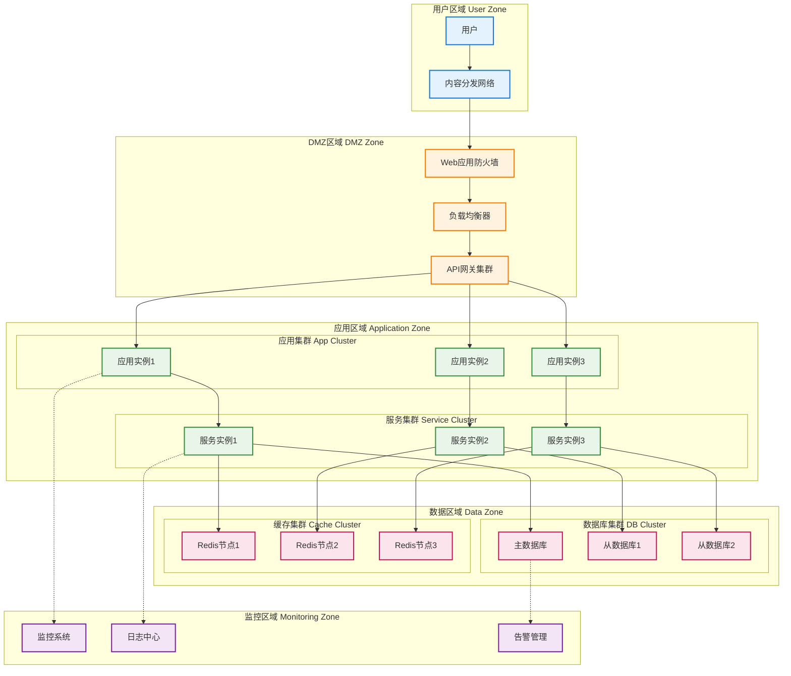
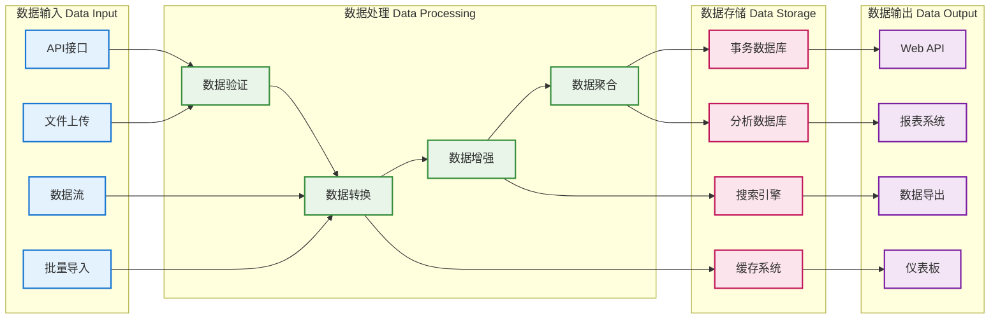

# 系统架构图

## 📊 架构概述

本文档展示了系统的整体架构设计，包括各层次组件、模块划分和交互关系。

## 🏗️ 整体架构图

## 🔧 核心模块架构

## 🌐 部署架构图

## 🔄 数据流架构

## 🏛️ 分层架构说明

### 客户端层 (Client Layer)
- **Web应用**: 基于浏览器的用户界面
- **移动应用**: iOS和Android原生应用
- **桌面应用**: 跨平台桌面客户端
- **第三方集成**: 外部系统集成接口

### 接入层 (Gateway Layer)
- **负载均衡器**: 流量分发和高可用保障
- **API网关**: 统一的API入口和路由
- **限流控制**: 请求频率限制和熔断保护
- **认证授权**: 用户身份验证和权限控制

### 应用层 (Application Layer)
- **用户服务**: 用户管理和认证相关功能
- **业务服务**: 核心业务功能实现
- **通知服务**: 消息推送和通知功能
- **文件服务**: 文件上传、存储和管理

### 业务逻辑层 (Business Logic Layer)
- **核心业务逻辑**: 主要的业务处理逻辑
- **规则引擎**: 业务规则的配置和执行
- **工作流引擎**: 业务流程的编排和执行
- **事件处理器**: 事件的监听和处理

### 数据访问层 (Data Access Layer)
- **对象关系映射**: 数据库访问抽象层
- **数据缓存**: 高速数据缓存服务
- **搜索引擎**: 全文搜索和复杂查询
- **消息队列**: 异步消息处理

### 数据存储层 (Data Storage Layer)
- **主数据库**: 主要的事务数据存储
- **只读数据库**: 读取专用的数据库副本
- **NoSQL数据库**: 非关系型数据存储
- **文件存储**: 静态文件和媒体资源存储

### 基础设施层 (Infrastructure Layer)
- **监控系统**: 系统性能和健康监控
- **日志系统**: 统一的日志收集和分析
- **配置中心**: 集中化的配置管理
- **服务注册**: 微服务的注册和发现

## 🔧 技术选型

### 开发框架
- **后端框架**: [如Gin、Echo、Fiber等]
- **数据库ORM**: [如GORM、Ent等]
- **缓存框架**: [如go-redis等]
- **消息队列**: [如RabbitMQ、Kafka等]

### 数据存储
- **关系数据库**: [如MySQL、PostgreSQL等]
- **NoSQL数据库**: [如MongoDB、Redis等]
- **搜索引擎**: [如Elasticsearch等]
- **文件存储**: [如MinIO、OSS等]

### 基础设施
- **容器化**: [如Docker、Kubernetes等]
- **监控工具**: [如Prometheus、Grafana等]
- **日志工具**: [如ELK Stack等]
- **CI/CD**: [如Jenkins、GitLab CI等]

## 📝 架构设计原则

### 设计原则
1. **单一职责**: 每个组件只负责一个明确的功能
2. **松耦合**: 组件间通过接口交互，减少直接依赖
3. **高内聚**: 相关功能集中在同一个模块内
4. **可扩展**: 支持水平和垂直扩展
5. **可维护**: 代码结构清晰，易于理解和修改

### 架构特点
- **分层架构**: 清晰的层次划分和职责分离
- **微服务**: 服务的独立部署和扩展
- **事件驱动**: 基于事件的异步处理
- **数据分离**: 读写分离和数据分片

## 🔄 架构演进

### 当前架构优势
- [列出当前架构的主要优势]
- [性能特点和扩展能力]
- [维护性和可靠性]

### 已知限制
- [当前架构的限制和瓶颈]
- [需要改进的方面]
- [技术债务]

### 演进计划
- **短期优化**: [3-6个月内的架构优化计划]
- **中期重构**: [6-12个月内的重构计划]
- **长期规划**: [1年以上的架构演进方向]

## 📚 相关文档

- [时序图](时序图.md) - 组件交互时序图
- [流程图](流程图.md) - 业务流程图
- [技术选型和架构](../技术选型和架构.md) - 架构与设计说明

## 🔄 更新记录

- YYYY-MM-DD: 创建系统架构图文档
- YYYY-MM-DD: 添加部署架构和数据流架构
- YYYY-MM-DD: 完善技术选型和设计原则
