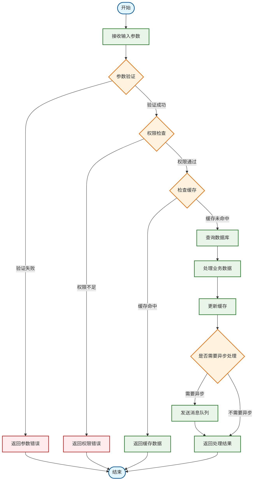
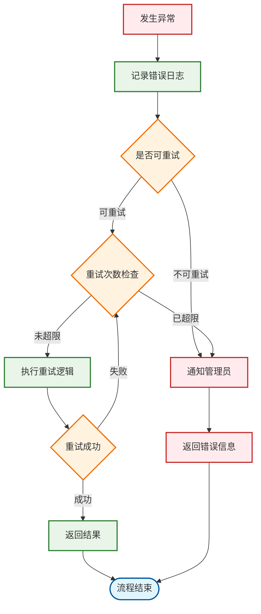
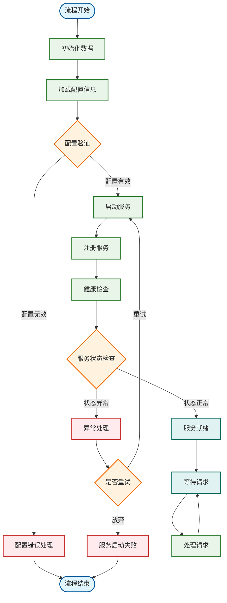
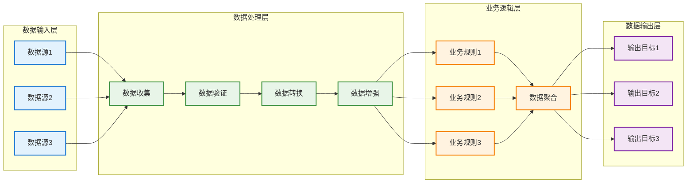
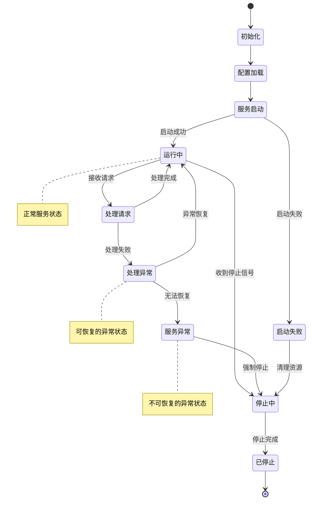

# 流程图

## 📊 流程图说明

本文档展示了系统中关键业务流程的流程图，帮助理解业务逻辑的决策点和执行路径。

## 🎯 [业务流程1]流程图

### 流程概述
[描述该业务流程的目的、输入条件和输出结果]

### 决策点说明
1. **参数验证**: [详细说明验证规则和失败处理]
2. **权限检查**: [详细说明权限验证逻辑]
3. **缓存检查**: [详细说明缓存策略和命中条件]
4. **异步处理**: [详细说明异步处理的触发条件]

### 异常处理流程

## 🎯 [业务流程2]流程图

### 流程概述
[描述该业务流程的目的、输入条件和输出结果]

## 🎯 [业务流程3]流程图

### 流程概述
[描述该业务流程的目的、输入条件和输出结果]

## 🎯 状态转换流程图

### 状态说明
[描述系统中各种状态的含义和转换条件]

## 📝 流程图设计规范

### Mermaid语法注意事项
1. **节点标识**: 使用简洁的英文标识符，中文说明放在方括号或引号中
2. **连接线标签**: 复杂的中文标签使用双引号包围：`|"标签文本"|`
3. **子图使用**: 使用subgraph组织相关的节点
4. **样式定义**: 使用classDef定义统一的样式
5. **特殊字符**: 避免在节点标签中使用特殊字符

### 设计最佳实践
1. **节点数量**: 单个流程图节点数量控制在15个以内
2. **层次结构**: 使用子图表示不同的逻辑层次
3. **决策点**: 清晰标示所有的决策点和分支条件
4. **异常处理**: 重要的异常处理路径要明确展示
5. **样式统一**: 使用一致的颜色和样式表示不同类型的节点

### 常见错误避免
1. **方向混乱**: 保持流程的主要方向一致（通常是从上到下或从左到右）
2. **死循环**: 避免没有出口的循环结构
3. **遗漏路径**: 确保所有的决策分支都有对应的处理路径
4. **标签不清**: 决策点的条件标签要清晰明确
5. **语法错误**: 注意Mermaid语法的正确性，特别是引号和特殊字符

## 🔄 流程图维护

### 更新原则
- 业务逻辑变更时同步更新流程图
- 新增业务流程时及时补充流程图
- 定期审查流程图与实际实现的一致性

### 审查清单
- [ ] 流程起点和终点是否明确
- [ ] 所有决策分支是否完整
- [ ] 异常处理路径是否覆盖
- [ ] 节点标签是否清晰准确
- [ ] 流程方向是否合理
- [ ] 样式是否统一规范

## 📚 相关文档

- [架构图](架构图.md) - 系统整体架构设计
- [时序图](时序图.md) - 组件交互时序图
- [技术选型和架构](../技术选型和架构.md) - 架构与设计说明

## 🔄 更新记录

- YYYY-MM-DD: 创建流程图文档模板
- YYYY-MM-DD: 添加[具体业务流程]流程图
- YYYY-MM-DD: 完善状态转换流程图
