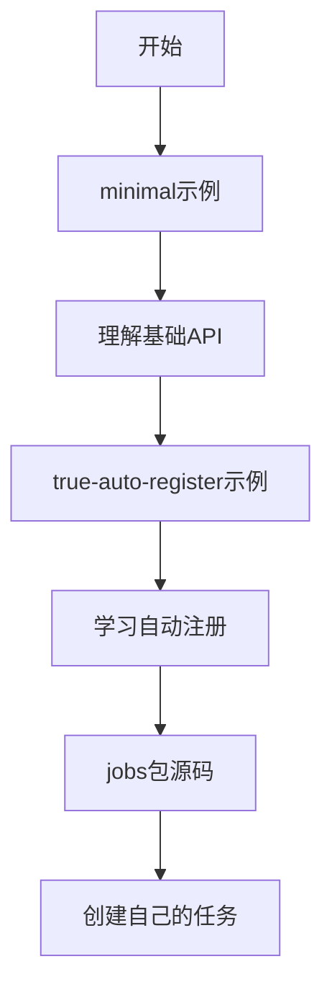

# Cron库示例

本目录包含了展示cron库各种功能的示例程序。

## 📁 示例目录

### [minimal/](./minimal/) - 极简使用示例
展示cron库的基础用法：
- 函数调度 (`Schedule`)  
- Job接口调度 (`ScheduleJob`)
- 配置选项（超时、异步、并发控制）
- 监控统计功能

```bash
cd examples/minimal && go run main.go
```

### [true-auto-register/](./true-auto-register/) - 自动注册示例  
演示如何使用空导入实现任务自动注册：
- 空导入触发注册 (`import _ "jobs"`)
- 一键调度所有注册任务 (`ScheduleRegistered`)
- 任务与调度逻辑解耦

```bash
cd examples/true-auto-register && go run main.go
```

### [context-lifecycle/](./context-lifecycle/) - WithContext生命周期管理
演示调度器与应用生命周期绑定：
- 优雅关闭与信号集成
- 级联取消机制
- 微服务架构应用
- 测试场景中的精确控制

```bash
cd examples/context-lifecycle && go run main.go
```

### [jobs/](./jobs/) - 示例任务包
包含可自动注册的示例任务：
- BackupJob - 自动备份任务
- CleanupJob - 自动清理任务  
- MonitorJob - 系统监控任务

## 🚀 快速开始

1. **基础使用**：从`minimal`示例开始
2. **生命周期管理**：查看`context-lifecycle`了解优雅关闭
3. **高级功能**：查看`true-auto-register`了解自动注册
4. **任务开发**：参考`jobs`包学习如何创建可注册任务

## 📖 学习路径



## ⭐ 核心概念

### 两种调度方式
```go
// 1. 函数调度 - 简单直接
scheduler.Schedule("task-id", "*/5 * * * * *", func(ctx context.Context) {
    // 任务逻辑
})

// 2. Job接口调度 - 功能丰富
scheduler.ScheduleJob("job-id", "*/10 * * * * *", job, cron.JobOptions{
    Timeout: 30 * time.Second,
    Async:   true,
})
```

### 自动注册模式
```go
// 定义任务
type MyJob struct{}
func (j *MyJob) Name() string { return "my-job" }
func (j *MyJob) Schedule() string { return "0 0 * * * *" }
func (j *MyJob) Run(ctx context.Context) error { return nil }

func init() {
    cron.MustRegisterJob(&MyJob{})
}

// 使用任务
import _ "myapp/jobs"
scheduler.ScheduleRegistered() // 一键调度所有注册任务
```

## 🔧 运行要求

- Go 1.21+
- 无外部依赖

所有示例都是独立的，可以直接运行！